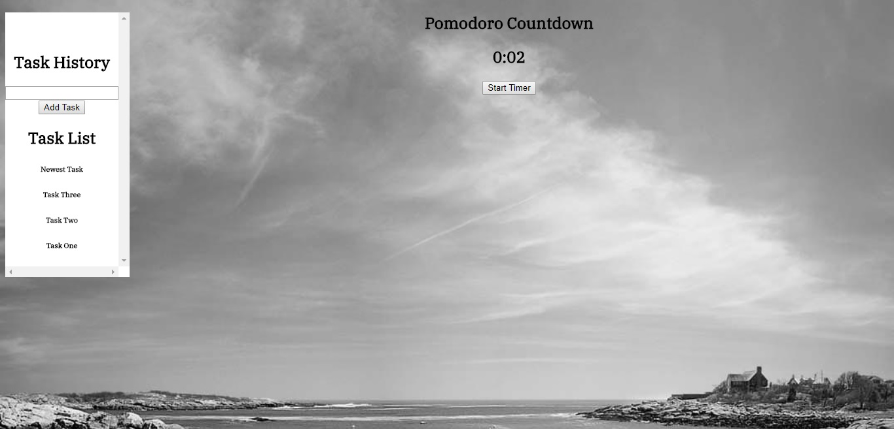

Emily's Pomodoro Timer Application

This app was created to follow the Pomodoro time management strategy of 25 minutes of uninterrupted work time, with 5 minute breaks. After four rounds of 25 minute work sessions, you get a 30 minute break. This is to maximize your effectiveness by having you focus for 25 minutes and relax for your break times. You can also log your tasks in Firebase using this app, in order to keep track of what you have accomplished.

For the ease of testing this out, I have shortened the times to seconds instead of minutes.

I created this app using HTML, CSS, Angular JavaScript, and Firebase.

